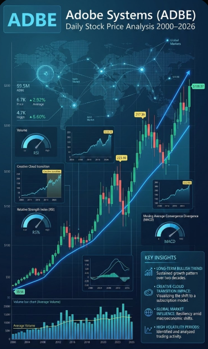

<p align="center">
  <a href="https://www.kaggle.com/code/hassanjameelahmed/adobe-adbe-daily-stock-prices-2000-2026" target="_blank">
    
  </a>
</p>

## Adobe (ADBE) Daily Stock Prices 2000–2026 – Clean Time‑Series Dataset

### 1. Project Overview (PRD)

- **Problem statement**: Provide a clean, well‑documented, single‑asset daily stock price dataset for Adobe Inc. (`ADBE`) suitable for time‑series forecasting, risk analysis, and educational use on Kaggle.
- **Primary goal**: Enable analysts and data scientists to quickly experiment with technical indicators, price prediction models, volatility modelling, and event‑driven analysis using long‑horizon historical data.
- **Target users**: 
  - **Data scientists / quants** exploring equity time‑series modelling.
  - **Students / educators** teaching financial time‑series, forecasting, and feature engineering.
  - **Developers** building trading, backtesting, or visualization demos.
- **Key features**:
  - Long time coverage (over 26 years of trading days).
  - Standard OHLCV structure plus an adjusted price column.
  - Single ticker (Adobe Inc., `ADBE`) for focused experiments.
  - Minimal preprocessing so users can apply their own pipelines.
- **Success metrics**:
  - Number of Kaggle downloads / notebooks using the dataset.
  - Variety of use cases (forecasting, anomaly detection, pattern mining).
  - Low number of user issues related to data quality or documentation.

---

### 2. Dataset Summary (Kaggle-Style Description)

- **Title**: Adobe (ADBE) Daily Stock Prices 2000–2026 (OHLCV & Adjusted Close)
- **Entity**: Adobe Inc. (`ADBE`), a large‑cap software company listed on NASDAQ.
- **Frequency**: One row per trading day.
- **Time span**: From **2000-01-03** to **2026-01-30**.
- **Number of rows**: **6,559** daily observations (after headers).
- **Number of columns**: **6** numeric columns plus implicit single ticker (`ADBE`) and date.
- **File format**: `ADBE.csv`
- **Typical use cases**:
  - Univariate / multivariate time‑series forecasting (e.g., next‑day close).
  - Technical indicator computation (moving averages, RSI, MACD, Bollinger Bands).
  - Volatility and drawdown analysis.
  - Event‑study analysis around earnings or macro events (if user adds calendar data).
  - Educational demos in Python / R / SQL / BI tools.

---

### 3. Columns and Data Dictionary

Raw file structure (first lines):

```1:6:c:\Users\HassanJameel\OneDrive - United Group\Desktop\Adobe\ADBE.csv
Price,Close,High,Low,Open,Volume
Ticker,ADBE,ADBE,ADBE,ADBE,ADBE
Date,,,,,
2000-01-03,16.27467155456543,16.75561990365173,15.948867834216648,16.693562052156725,7384400
2000-01-04,14.909399032592773,16.336729637169814,14.878370106406317,15.638578797974523,7813200
2000-01-05,15.204174995422363,15.5765221381674,14.459480709932288,14.459480709932288,14927200
```

Interpreted column semantics:

| Column | Type   | Unit / Format     | Example         | Description |
|--------|--------|-------------------|-----------------|-------------|
| `Date` | string (date) | `YYYY-MM-DD`      | `2000-01-03`    | Trading date for the observation. One row per market trading day (weekends and market holidays are excluded). |
| `Price` | float | Currency (USD)    | `16.27`         | **Adjusted close price** for `ADBE` on that trading day. Adjusted for stock splits and potentially dividends, making it suitable for long‑term return calculations and modelling. |
| `Close` | float | Currency (USD)    | `16.76`         | Official end‑of‑day closing price as reported by the exchange for `ADBE`. Not adjusted for corporate actions. |
| `High` | float | Currency (USD)    | `16.76`         | Highest traded price of `ADBE` during the trading session. Useful for volatility and range analysis. |
| `Low`  | float | Currency (USD)    | `15.95`         | Lowest traded price of `ADBE` during the trading session. |
| `Open` | float | Currency (USD)    | `16.69`         | Opening price of `ADBE` at the start of the trading session. |
| `Volume` | integer | Shares          | `7384400`       | Number of shares of `ADBE` traded during the trading session. High volume often signals strong interest or news events. |

Additional implicit information:

- **Ticker**: All rows correspond to **Adobe Inc.**, ticker **`ADBE`**.
- **Currency**: USD (US dollars), as the stock is traded on a US exchange (NASDAQ).
- **Missing values**: The sample indicates complete records for trading days; missing days correspond to weekends / market holidays, not data gaps.

---

### 4. Top 5 Kaggle Tags (Project & Dataset)

Recommended tags for Kaggle:

1. **`stock-market`** – Dataset contains equity price data suitable for trading and financial analysis.
2. **`time-series`** – Daily chronological observations ideal for forecasting and temporal modelling.
3. **`finance`** – Financial market data related to a publicly traded company.
4. **`equity-prices`** – OHLCV price series for a single stock.
5. **`adobe`** – Company‑specific tag to help users interested in Adobe Inc. find the dataset.

You can also optionally add: **`forecasting`**, **`machine-learning`**, **`econometrics`**, or **`quantitative-finance`** as secondary tags.

---

### 5. SEO‑Optimized Project Name and Description

- **SEO‑optimized dataset name**:  
  **“Adobe (ADBE) Historical Stock Prices 2000–2026 – Daily OHLCV & Adjusted Close”**

- **SEO‑optimized short description**:  
  **“Clean daily Adobe (ADBE) stock price data from 2000–2026 with OHLCV and adjusted close values for time‑series forecasting, trading strategy backtesting, and financial analysis.”**

- **SEO‑optimized long description** (Kaggle “Description” section):

> This dataset provides over 26 years of **daily historical stock prices for Adobe Inc. (ADBE)**, including **Open, High, Low, Close, Adjusted Close (Price), and Volume**. The data spans from **2000‑01‑03** to **2026‑01‑30** and is formatted as a simple CSV file that can be loaded directly into Python, R, Excel, or BI tools.
>
> With a standard **OHLCV** structure and a long time horizon, this dataset is ideal for **time‑series forecasting**, **technical analysis**, **volatility and risk modelling**, and **educational projects**. Users can easily engineer features such as moving averages, RSI, MACD, Bollinger Bands, and candlestick patterns, or combine this data with macroeconomic indicators and earnings calendars for event‑driven studies.
>
> Because it focuses on a single large‑cap technology stock listed on NASDAQ, the dataset is especially useful for demonstrating **end‑to‑end ML workflows**, from data cleaning and feature engineering to model training, evaluation, and deployment on a well‑known real‑world asset.

---

### 6. Coverage Information

- **Temporal coverage**:
  - **Start date**: **2000-01-03**
  - **End date**: **2026-01-30**
  - **Frequency**: One row per **trading day** (no rows for weekends and US market holidays).
  - **Length**: **6,559** trading‑day observations (approximately 26+ years of history).

- **Variable coverage**:
  - **Prices**: Full daily OHLC plus adjusted close (`Price`) for the entire period.
  - **Volume**: Daily share volume is present for every trading day.
  - **Single asset**: All rows correspond to **one equity**, Adobe Inc. (`ADBE`).

- **Analytical coverage**:
  - Suitable for **short‑term** (days to weeks) and **long‑term** (years) return analysis.
  - Supports modelling of **trends, cycles, and volatility regimes** across multiple market phases (dot‑com aftermath, 2008 crisis, 2020 pandemic, etc.).

---

### 7. Temporal and Geospatial Scope

- **Temporal scope**:
  - **Start date**: **2000-01-03** (first available trading day in the file).
  - **End date**: **2026-01-30** (last available trading day in the file).
  - **Granularity**: Daily (end‑of‑day) data aligned to the US stock market trading calendar.

- **Geospatial scope**:
  - **Market / Exchange**: `ADBE` is listed on **NASDAQ**, part of the US equity markets.
  - **Country**: **United States of America** (primary listing jurisdiction).
  - **Issuer location**: Adobe Inc. is headquartered in **San Jose, California, USA**.

For Kaggle documentation, you can state that the dataset covers **US equity market data** for a single globally traded technology stock.

---

### 8. Provenance (Source and Transformations)

- **Original data source (most likely)**:
  - The CSV structure (`Date`, OHLCV, adjusted price) and naming strongly match the export format of **[Yahoo Finance – Adobe Inc. (ADBE) Historical Data](https://finance.yahoo.com/quote/ADBE/history/)**.
  - The dataset appears to be obtained by exporting **daily ADBE historical prices** from Yahoo Finance over the full available date range.

- **Provenance explanation**:
  - Yahoo Finance aggregates official **exchange‑reported prices and volumes** for listed securities like `ADBE`.
  - For each trading day, Yahoo provides **Open, High, Low, Close, Adjusted Close, and Volume** values.
  - The `Price` column in this dataset is interpreted as **Adjusted Close**, and the `Close` column as the raw closing price.

- **Transformations applied to create this CSV** (as implied by the file structure):
  - Exported or downloaded historical ADBE data for the full date range.
  - Standardized to a single ticker (`ADBE`) and saved as a CSV with:
    - A header row of numeric columns (`Price,Close,High,Low,Open,Volume`).
    - A second row indicating the ticker (`Ticker,ADBE,...`).
    - A third row indicating the date label (`Date,,,,,`).
  - No complex cleaning or resampling appears to have been applied; all trading days are kept as‑is.

- **Reusability context**:
  - Because the dataset is derived from a well‑known financial data provider, other users can **reproduce or update** the data by re‑downloading from Yahoo Finance using the same ticker and date range.

---

### 9. Dataset Collection Methodology

High‑level methodology for collecting and preparing the dataset:

1. **Define the asset and period**  
   - Choose **Adobe Inc. (ADBE)** as the focus ticker.  
   - Select a large time window from **2000-01-03** to **2026-01-30** to cover multiple market cycles.

2. **Download raw historical data**  
   - Use **Yahoo Finance** (web interface or API‑style URL) to download **daily historical prices** for `ADBE` over the chosen period.  
   - Export the data as CSV, which typically includes `Date, Open, High, Low, Close, Adj Close, Volume`.

3. **Standardize columns**  
   - Map **Adjusted Close** to the `Price` column.  
   - Keep other columns as‑is: `Close`, `High`, `Low`, `Open`, `Volume`.  
   - Add a `Ticker` row to explicitly label the instrument as `ADBE`.

4. **Validate completeness and consistency**  
   - Check that each trading day in the exchange calendar has one row.  
   - Confirm that there are **no duplicate dates** and that numeric values are within plausible ranges.

5. **Finalize dataset for Kaggle**  
   - Save the final CSV as `ADBE.csv`.  
   - Create this `app.md` file to document the dataset’s **structure, scope, provenance, and limitations** for reuse.

This methodology can be replicated for other tickers or extended to multi‑asset datasets if desired.

---

### 10. Biggest Problems and Challenges

Key challenges and limitations for this project and dataset:

1. **Single‑asset scope**  
   - The dataset only covers **one stock (`ADBE`)**, which limits cross‑sectional analysis and portfolio‑level research.  
   - Models trained solely on ADBE may not generalize to other assets.

2. **Survivorship and selection bias**  
   - Focusing on a successful, long‑lived company can introduce **survivorship bias**.  
   - Historical performance may not be representative of all stocks, especially those that delisted or underperformed.

3. **No corporate actions / dividends detail in the file**  
   - While the `Price` column is treated as adjusted close, explicit **dividend** and **split** events are not included.  
   - Users who need total‑return calculations must either rely on adjusted prices alone or bring in separate corporate‑action data.

4. **Exclusion of fundamental and macro variables**  
   - The dataset contains only **price and volume** data.  
   - For richer models, users must merge in external features such as earnings, interest rates, sector indices, or macroeconomic series.

5. **Regime shifts and non‑stationarity**  
   - Over 26+ years, ADBE has gone through **multiple market regimes** (crises, bull markets, pandemics).  
   - Many standard statistical and ML models assume stationarity, so users must carefully handle **structural breaks**, **volatility clustering**, and **changing dynamics**.

6. **Data licensing and redistribution concerns**  
   - Financial price data providers may have **terms of use** governing redistribution.  
   - Before publishing on Kaggle, you should verify that hosting this derivative dataset complies with Yahoo Finance (or chosen provider) licensing and Kaggle’s rules.

---

### 11. Source of the Dataset

- **Primary source (likely)**:  
  - **Name**: Yahoo Finance – Adobe Inc. (ADBE) Historical Data  
  - **URL**: `https://finance.yahoo.com/quote/ADBE/history/`

- **How this maps to the CSV**:
  - Yahoo Finance provides daily **Open, High, Low, Close, Adj Close, Volume** for ADBE.  
  - In this CSV:
    - `Price` ≈ **Adj Close**  
    - `Close` = **Close**  
    - `High`, `Low`, `Open`, `Volume` map directly.

If you want to regenerate or extend the dataset, you can revisit the Yahoo Finance ADBE page, select the desired date range, and export the CSV again.

---

### 12. How the Problem Developed (Step by Step)

This section explains the conceptual development of the project/problem from raw need to a Kaggle‑ready dataset:

1. **Recognizing the need for real financial time‑series data**  
   - Practitioners and learners often look for **clean, long‑term stock price data** to test forecasting models and trading ideas.  
   - Many existing datasets are either too small, poorly documented, or cover too many assets at once, making them harder for beginners.

2. **Choosing a representative, well‑known asset**  
   - Adobe Inc. (`ADBE`) is a **widely recognized technology company** with a long trading history.  
   - Its stock has experienced diverse market conditions (early‑2000s tech downturn, 2008 crisis, 2020 pandemic, changing interest‑rate environments), making it an excellent case study.

3. **Identifying a reliable data provider**  
   - Public financial portals like **Yahoo Finance** aggregate and publish historical OHLCV data for free.  
   - Yahoo Finance offers an easy CSV export mechanism, enabling reproducible data collection.

4. **Collecting and consolidating historical prices**  
   - The full historical range for ADBE is downloaded, yielding daily rows with **Date, OHLCV, and adjusted close**.  
   - The data is checked for obvious anomalies such as missing columns, malformed dates, or negative prices.

5. **Designing a simple, consistent schema**  
   - To keep the dataset **easy to understand and use**, only the core OHLCV fields plus an adjusted price are kept.  
   - A consistent naming scheme (`Price, Close, High, Low, Open, Volume`) is applied, and the file is standardized to one row per trading day.

6. **Documenting scope, provenance, and limitations**  
   - To make the dataset reusable on Kaggle, detailed documentation is created: this `app.md` includes **coverage, scope, methodology, provenance, and known challenges**.  
   - This step transforms a raw CSV into a **properly described dataset** that others can trust and extend.

7. **Packaging the project for Kaggle**  
   - The dataset (`ADBE.csv`) and this markdown file (`app.md`) become the core of a Kaggle dataset.  
   - The SEO‑optimized name, tags, and descriptions help users discover the dataset, while the PRD clarifies how it should be used.

8. **Enabling downstream ML and analytics projects**  
   - With a clear structure and documentation, users can build **notebooks and pipelines** for forecasting, backtesting, anomaly detection, and more.  
   - Feedback and contributions from the community can lead to improved versions (e.g., adding more tickers, fundamentals, or macro features).

---

### 13. How to Use This Dataset on Kaggle

- **Basic usage**:
  - Load `ADBE.csv` with `pandas`, `data.table`, or similar tools.
  - Parse `Date` as a datetime index and sort chronologically.
  - Plot OHLC charts and basic indicators to understand price dynamics.

- **Example analyses**:
  - Build a **next‑day close price** forecasting model using lagged features.
  - Compute **rolling volatility** and perform risk analysis over different regimes.
  - Backtest simple strategies (e.g., moving‑average crossover) and evaluate performance.

This section is optional for the Kaggle dataset page but can be copied into the **“Usage”** or **“Inspiration”** fields to help users get started quickly.

